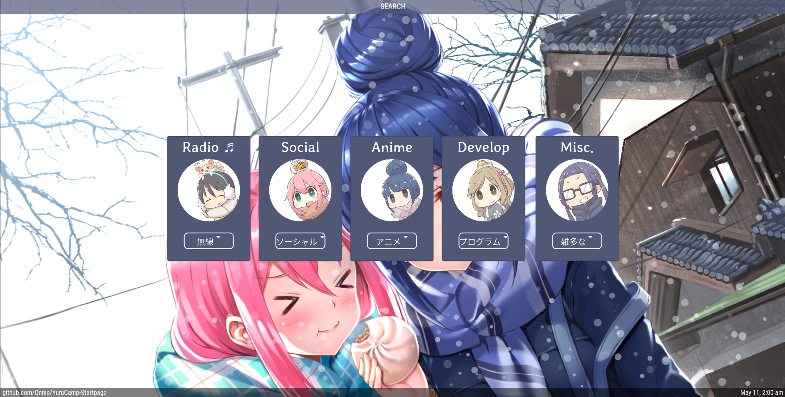

# YuruCamp-Startpage


[Demo](https://qnnie.github.io/YuruCamp-Startpage/)

Search Tips
------------------------------
<ul>
<li>-y something > YouTube Search </li>
<li>-k something > Kissanime Search </li>
<li>-d something > Duckduckgo Search </li>
<li>-r something > Reddit Search </li>
<li>Tab Key > Enable search </li>
</ul>

Configure Links 
----------------------------
Open up index.html and look for this reoccuring pattern, card > links
```html
          <div class="card" id="Nadeshiko">
              <a href='https://www.youtube.com' target='_blank'><button class="dropdown-item" type="button">YouTube</button></a>
              <a href='https://reddit.com' target='_blank'><button class="dropdown-item" type="button">Reddit</button></a>
              <a href='https://twitter.com' target='_blank'><button class="dropdown-item" type="button">Twitter</button></a>
              <a href='https://www.instagram.com' target='_blank'><button class="dropdown-item" type="button">Instagram</button></a>
```
Make the necessary changes and reopen the HTML file in a browser.
<br>
Feel free to look around and mess around with whats there, it's not done yet, Enjoy~

